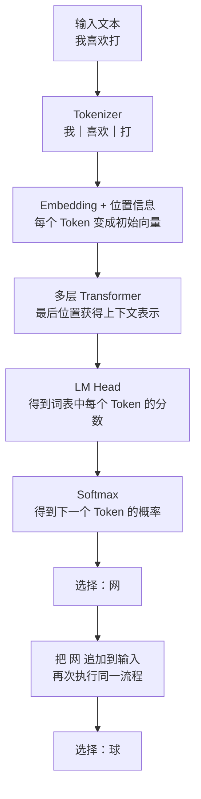

# Day 0：一次推理如何从“我喜欢打”生成“网球”

> 本文件由教程脚本自动生成。请修改源脚本后重新渲染，不要手工编辑。

生成来源：`lessons/transformer/day00-inference-overview/run.sh`

## 1. 本课只看一次推理

本课固定研究一个问题：LLM 收到 `我喜欢打` 后，怎样继续生成 `网球`？
这里讨论的是**推理**：模型参数已经训练完成，本次过程不会修改参数。

**输入：** `我喜欢打`

**最终可见输出：** `我喜欢打网球`

模型一次只预测一个 Token。使用本课程的 tokenizer 时，`网球` 是两个 Token，
所以完整生成需要两轮：先生成 `网`，再生成 `球`。

## 2. 先看完整流程，不展开公式



## 3. 第一轮：从“我喜欢打”预测“网”

### 3.1 文本变成模型可以计算的输入

```text
文本：我喜欢打
Token：[我] [喜欢] [打]
Token ID：[7522, 69681, 15552]
```
Token ID 只是词表索引。Embedding 层把每个 ID 查成向量，再加入位置信息。

### 3.2 Transformer 改写每个位置的表示

Self-Attention 让最后一个 Token `打` 读取前面的 `我`、`喜欢` 和自己。
经过 Attention、FFN、残差连接和多层堆叠后，最后位置得到一个上下文向量。
这个向量表达的不是孤立的“打”，而是当前上下文中的“我喜欢打”。

> Attention 的输出仍然是向量，不是文字，也不是“网球”的概率。

### 3.3 最后一个向量变成下一个 Token 的概率

LM Head 把最后位置的向量映射成整个词表的分数（logits），Softmax 再转成概率。
下面的数字只用于展示输出形式，不代表真实模型结果：

| 候选 Token | 示例概率 |
| --- | ---: |
| `网` | 42% |
| `球` | 18% |
| `游戏` | 12% |
| 其他 Token | 28% |

解码策略从概率分布中选出 `网`，再把它追加到输入末尾。

## 4. 第二轮：从“我喜欢打网”预测“球”

```text
新输入：我喜欢打网
Token：[我] [喜欢] [打] [网]
再次经过：Embedding -> Transformer -> LM Head -> Softmax
选出下一个 Token：[球]
```
把 `球` 追加后，用户最终看到 `我喜欢打网球`。

## 5. 每个组件接收什么、输出什么

| 组件 | 输入 | 输出 |
| --- | --- | --- |
| Tokenizer | 文本 | Token ID 序列 |
| Embedding | Token ID + 位置 | 初始向量序列 |
| Transformer 层 | 向量序列 | 融合上下文后的向量序列 |
| LM Head | 最后位置的向量 | 词表 logits |
| Softmax | logits | 下一个 Token 的概率分布 |
| 解码策略 | 概率分布 | 选中的下一个 Token |
| 生成循环 | 新 Token | 追加 Token 后再次预测 |

## 6. 训练暂时不进入这条主线

训练会使用完整文本 `我喜欢打网球`，让模型学习：看到 `我喜欢打` 时，
正确的下一个 Token 是 `网`；看到 `我喜欢打网` 时，正确答案是 `球`。
Loss、反向传播和参数更新将在推理主线走通后单独讲解。

## 7. 本课结论

```text
输入文本
-> Token ID
-> 初始向量
-> 上下文向量
-> 词表概率
-> 选出一个 Token
-> 追加后继续下一轮
```
后续每一课只放大其中一个步骤，但始终回到这条推理链定位。
