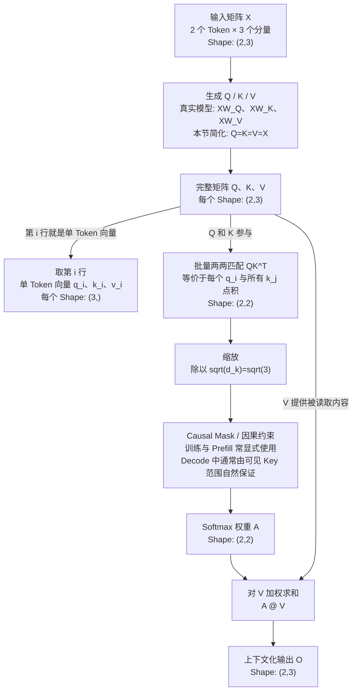

# Day 2：Self-Attention 如何读取上下文

> 本文件由教程脚本自动生成。请修改源脚本后重新渲染，不要手工编辑。

生成来源：`lessons/transformer/day02-self-attention/run.sh`

## 先说目的：这页到底在学习什么

> **本页目标：** 理解 GPT 的一个 Transformer 层在一次前向计算中，
> 每个 Token 如何只读取自己和前文，并生成包含上下文的新向量。

对 Agent 工程师来说，学习它不是为了手算矩阵，而是为了理解：
- LLM 为什么能根据上下文改变同一个 Token 的表示；
- GPT 为什么必须从左到右生成，不能读取未来答案；
- 后续的 KV Cache、长上下文成本和推理延迟问题从哪里来。

这不是一套独立的“训练算法”或“推理算法”，而是两者都会调用的
**Causal Self-Attention 前向计算机制**。

| 使用场景 | Causal Mask / 因果约束如何出现 |
| --- | --- |
| 训练 | 整段 Token 并行计算；必须遮住右上角的未来位置，防止答案泄漏 |
| 推理 Prefill | 整段 Prompt 并行计算并建立 KV Cache；同样遵守 Causal Mask |
| 推理 Decode | 一次只计算新 Token，K/V 中只有过去和当前；没有未来 Key，通常不必显式创建完整 Mask |

本页的 2-Token 示例一次计算两个位置，最接近训练或 Prefill 中的并行前向计算，
但它讲的是三者共享的 Attention 核心，不讲训练或推理的完整流程。

**本页明确不讨论：**
- 训练专属：next-token label、loss、反向传播、参数更新；
- 推理专属：采样、逐 Token 生成循环、KV Cache 的存取优化。

## 本页知识流程图



读图时先抓住两条关系：
1. 小写 `q_i/k_i/v_i` 是大写 `Q/K/V` 的一行；
2. 逐 Token 计算与矩阵并行计算等价，后者一次完成全部 Token。

## 课程位置与目标

你现在位于整条链路的这个位置：
```text
文本 -> Token -> Token ID -> 输入向量 X -> [今天学习 Self-Attention] -> 上下文化向量
```

本节 Token：`['Agent', 'tools']`

> **本节只回答一个问题：** 每个 Token 应该从其他 Token 读取多少信息？
为了先看清数据流，Q、K、V 暂时直接使用同一份输入向量。真实模型会通过可训练矩阵分别生成 Q、K、V，后续再学。

## 步骤 1：准备 Transformer 输入 X

Shape 的严格数学含义始终是 `(行数, 列数)`。
所以 X 的形状 `(2, 3)` 首先只表示：这个矩阵有 2 行、3 列。

然后再解释本例为行列赋予的语义：
- 2 行：每行放一个 Token 的向量，所以本例对应 2 个 Token
- 3 列：每行有 3 个分量，所以本例的每个 Token 使用 3 维向量
- 因此矩阵中共有 2 x 3 = 6 个数

> `(2, 3) = 2 行 3 列` 是严格定义；`2 个 Token、每个向量 3 维` 是本例的语义解释。

本教程当前采用的二维布局：
```text
X.shape = (Token 数量, 每个 Token 的向量维度)
```
这个语义映射依赖当前数据布局，不是所有张量都永远这样解释。

**输入向量 X**，形状：`(2, 3)`
```text
[[1. 2. 3.]
 [3. 2. 1.]]
```

把矩阵的每一行和 Token 对上：
- 'Agent'  -> [1.0, 2.0, 3.0]
- 'tools'  -> [3.0, 2.0, 1.0]

数字 `1、2、3` 只是方便手算的占位值，不代表预先定义好的语义。
脚本显示成 `1.0、2.0、3.0`，是因为计算使用浮点数。

此时每一行主要表示自己的信息，还没有读取其他 Token。

## 步骤 2：同一个输入分别扮演 Q、K、V 三种角色

Q（Query）：当前 Token 想找什么信息。
K（Key）：每个 Token 可以用什么特征被匹配。
V（Value）：匹配成功后，真正被读取的内容。

本节为降低难度，令 Q = K = V = X，所以三个矩阵暂时相同。

先用大小写严格区分单个 Token 和完整矩阵：
- 小写 `q_Agent`：`Agent` 自己的 Query 向量，长度为 3；
- 小写 `q_tools`：`tools` 自己的 Query 向量，长度为 3；
- 大写 `Q`：包含当前序列里所有 Token 的小写 q，每个 q 占一行。

本例的组装过程：
```text
q_Agent = [1,2,3]    # 单个 Token，一个长度为 3 的向量
q_tools = [3,2,1]    # 单个 Token，一个长度为 3 的向量

Q = [q_Agent,        # 第 1 行
     q_tools]        # 第 2 行

Q = [[1,2,3],
     [3,2,1]]        # 完整 Q 的形状是 (2,3)
```
K、V 同理：单个 Token 分别有小写 k、v 向量；全部 Token 叠起来得到大写 K、V。

> `(2,3)` 的第一维已经包含两个 Token，因此它属于完整 Q，不能再说它只属于 `Agent`。

三个层次不要混在一起：
```text
单 Token：q_Agent 或 q_tools -> (3,)
整条序列：Q = stack(q_Agent, q_tools) -> (2,3)
两两分数：Q @ K.T -> (2,2)
```
**Q 只有一个吗？** 在本教程限定的“一条序列、一个 layer、一个 head”里，
只有一个大写 Q，它包含两个 Token 的两行。真实模型有多个 layer 和 head，
每个 head 都有自己的 Q；工程上通常把它们收进带 batch/head 维度的张量。

这里 Q、K、V 数值相同只是教学简化。真实模型通过不同参数生成它们，数值通常不同。

**Q**，形状：`(2, 3)`
```text
[[1. 2. 3.]
 [3. 2. 1.]]
```

**K**，形状：`(2, 3)`
```text
[[1. 2. 3.]
 [3. 2. 1.]]
```

**V**，形状：`(2, 3)`
```text
[[1. 2. 3.]
 [3. 2. 1.]]
```

### 2.1 大写 Q 是否真的参与计算？

**会。** 但它和“每个 Token 分别计算”不是两套算法，而是同一算法的两种写法。

真实模型通常直接对完整输入矩阵做投影：
```text
逐 Token 写法：q_Agent = x_Agent @ W_Q
               q_tools = x_tools @ W_Q

矩阵写法：     Q = X @ W_Q
```
矩阵乘法会逐行处理 X，所以 `Q = X @ W_Q` 的第 1 行就是 `q_Agent`，
第 2 行就是 `q_tools`。因此 Q 在数学上等于所有 q 按行排列；
真实代码通常一次算出 Q，不一定真的先创建两个 q 再调用 `stack`。

计算 Attention 时也完全等价：
```text
逐 Token：q_Agent @ K.T = [14,10]
           q_tools @ K.T = [10,14]

矩阵并行：Q @ K.T = [[14,10],
                      [10,14]]
```
所以你的说法“每个 Token 的 qkv 去计算”在概念上是对的，但要补全：
- 每个 Token 的 `q_i` 会和**所有 Token 的 `k_j`**计算匹配分数；
- 再用这些分数形成权重，对**所有允许读取的 `v_j`**加权求和；
- 大写 Q、K、V 只是把所有 Token 的向量装进矩阵，方便一次并行完成。

> Q 不是额外产生的新信息；它是所有 q 的矩阵表示，也是实际并行计算使用的张量。

## 步骤 3：QK^T 计算 Token 两两之间的匹配分数

本步骤要回答：每个 Token 与每个 Token 的匹配程度是多少？

### 3.0 先别背规则：它只是批量计算匹配分数

先只问一个非常具体的问题：**`tools` 和 `Agent` 匹不匹配？**

先看完整 Q，它是 2 行 3 列：

| Q 中的行 | 单 Token 的 q 向量 | 本次是否选中 |
| --- | --- | --- |
| `Agent` | `[1, 2, 3]` |  |
| `tools` | `[3, 2, 1]` | **是，抽出第 2 行** |

> 表里的 `tools Query` 更严格地应写成小写 `q_tools`，它是完整 Q 的一行。

同样，完整 K 也是 2 行 3 列；为了和 `tools` 比较，这次只抽出
`k_Agent = [1, 2, 3]`，也就是 K 的第 1 行。

当前教程先观察一个 Attention head。在一个 head 中，一个 Token 对应一个
Query 向量，所以 `tools` 对应一行；两个 Token 合在一起才组成完整 Q 的两行。

现在把选出的两个向量放进手算表。它们各有 3 个分量：

| 分量位置 | 1 | 2 | 3 |
| --- | ---: | ---: | ---: |
| `q_tools` | 3 | 2 | 1 |
| `k_Agent` | 1 | 2 | 3 |
| 对应位置相乘 | 3×1=3 | 2×2=4 | 1×3=3 |

然后把最后一行加起来：

```text
3 + 4 + 3 = 10
```
这个 `10` 就是 `tools` 对 `Agent` 的一个原始匹配分数。

但 Attention 不只需要这一个分数：
- `tools` 还要和自己比较；
- `Agent` 也要分别和 `Agent`、`tools` 比较；
- 2 个读取者 × 2 个信息来源，总共要计算 **4 个分数**。

> `Q @ K.T` 只是把这 4 次同样的计算一次性完成。

所以在本节里，可以先把矩阵乘法理解为：**批量计算两两匹配分数**。
它不是 Attention 新增的一种判断逻辑，只是省去逐个计算的写法。

### 3.1 严格形状、标准理论与本例语义

先把三种说法分开：
- **严格 Shape：** `Q.shape = (2, 3)` 就是 Q 有 2 行、3 列；
- **本例语义：** 每行放一个 Token 的 Query 向量，所以是 2 个 Query 向量，每个有 3 个分量；
- **标准理论记号：** `Q: (n_q, d_k)`，本例 `n_q=2`、`d_k=3`。

因此，更准确的原句应该是：
> Q 是一个 2 行 3 列的矩阵；在本例中，2 行分别对应 2 个 Token 的 Query 向量，每行有 3 个分量。

标准的二维 Attention 形状关系是：
```text
Q:       (n_q, d_k)
K:       (n_k, d_k)
K.T:     (d_k, n_k)
Q @ K.T: (n_q, n_k)
```
Self-Attention 中 Q 和 K 来自同一序列，通常 `n_q = n_k = n`。
本例取 `n=2`、`d_k=3`，所以 Q 和 K 都是 2 行 3 列。

计算时，需要让一个 Query 横着与一个 Key 竖着对齐。
K.T 就是把 K 的每个 Token 从一行转成一列，形状从 (2, 3) 变成 (3, 2)。

**转置后的 K.T**，形状：`(3, 2)`
```text
[[1. 3.]
 [2. 2.]
 [3. 1.]]
```
这样才能进行矩阵乘法：

```text
Q (2, 3) @ K.T (3, 2) -> 原始分数 (2, 2)
```
这三个形状数字现在可以翻译成人话：
- 中间的 `3` 和 `3`：每次比较的 Query 和 Key 都有 3 个分量；
- 左侧的 `2`：有 2 个读取者；
- 右侧的 `2`：有 2 个候选信息来源；
- 最终 `2 × 2`：得到 4 个两两匹配分数。

**真实工程实现：** 多头 Attention 通常还会加上 batch 和 head 维度，例如
`(batch, heads, sequence_length, head_dim)`。不同框架可能调整维度顺序，
所以不存在唯一的官方存储顺序；稳定的是 `QK.T` 的计算关系。

参考：
- [Attention Is All You Need](https://arxiv.org/abs/1706.03762)
- [PyTorch MultiheadAttention](https://docs.pytorch.org/docs/stable/generated/torch.nn.MultiheadAttention.html)

### 3.2 把 2 × 2 的四个格子全部算完

每个格子都是一行 Query 与一行 Key 的点积：
```text
点积 = 对应位置相乘，再把乘积全部相加
```

这次不省略任何格子：
```text
① q_Agent · k_Agent
   [1,2,3] · [1,2,3] = 1x1 + 2x2 + 3x3 = 14

② q_Agent · k_tools
   [1,2,3] · [3,2,1] = 1x3 + 2x2 + 3x1 = 10

③ q_tools · k_Agent
   [3,2,1] · [1,2,3] = 3x1 + 2x2 + 1x3 = 10

④ q_tools · k_tools
   [3,2,1] · [3,2,1] = 3x3 + 2x2 + 1x1 = 14
```

**尚未缩放的 QK^T 原始分数**（行=读取者，列=信息来源）：

| 读取者 \ 来源 | Agent | tools |
| --- | ---: | ---: |
| Agent | 14.000 | 10.000 |
| tools | 10.000 | 14.000 |

把上面的四次手算合回一个完整矩阵等式：

```text
Q = [[1,2,3],
     [3,2,1]]

K.T = [[1,3],
       [2,2],
       [3,1]]

Q @ K.T = [[14,10],
           [10,14]]
```

### 3.3 为什么原始分数还要缩放？

每个 Query/Key 向量有 3 个分量，所以缩放因子是 sqrt(3) = 1.732。
注意这里使用的是向量维度 `d_k=3`，不是 Token 数量 `2`。
把四个原始分数都除以 sqrt(3)：

```text
Agent -> Agent：14 / 1.732 = 8.083
Agent -> tools：10 / 1.732 = 5.774
tools -> Agent：10 / 1.732 = 5.774
tools -> tools：14 / 1.732 = 8.083
```
缩放用于避免向量维度较大时点积过大，让后面的 Softmax 过于极端。

**缩放后的 Attention 分数**（行=读取者，列=信息来源）：

| 读取者 \ 来源 | Agent | tools |
| --- | ---: | ---: |
| Agent | 8.083 | 5.774 |
| tools | 5.774 | 8.083 |

到这里得到的仍是匹配分数，还不是最终读取比例。

## 步骤 4：Causal Mask 禁止偷看未来，再用 Softmax 变成比例

GPT 按从左到右生成文本，因此当前位置只能读取自己和左边的 Token。
本例中 `tools` 在 `Agent` 后面，所以对 `Agent` 来说，`tools` 属于未来。

Softmax 把允许读取的分数转换为 0 到 1 之间的权重。
列顺序： ['Agent', 'tools']

**Attention 权重**，形状：`(2, 2)`
```text
[[1.   0.  ]
 [0.09 0.91]]
```
每一行权重之和： [1.0, 1.0]

把每一行翻译成人话：
- 'Agent' 读取信息的比例：Agent 100.0%，tools 0.0%
- 'tools' 读取信息的比例：Agent 9.0%，tools 91.0%

## 步骤 5：按照 Attention 权重，对 V 向量加权求和

现在不是选择某一个 Token，而是按比例混合多个 Token 的 V。

**融合上下文后的向量**，形状：`(2, 3)`
```text
[[1.    2.    3.   ]
 [2.819 2.    1.181]]
```

以 'tools' 为例，它的新向量来自：
- `0.090 x 'Agent'` 的 V 向量
- `0.910 x 'tools'` 的 V 向量

因此，'tools' 的新向量不再只包含自己，也混入了前文信息。

## 本节总结

```text
输入向量 X -> Q、K、V -> QK^T 匹配分数 -> Causal Mask -> Softmax 权重 -> 对 V 加权求和 -> 上下文化向量
```

> **本节只需要记住：** Self-Attention 让每个 Token 按不同权重读取其他 Token 的信息。

### 观察题

为什么 `Agent` 的 Attention 权重是 `[1, 0]`？
