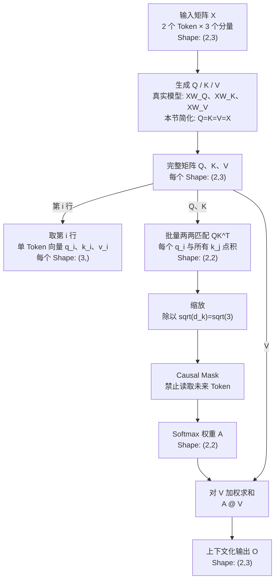

# Day 2：Self-Attention 如何读取上下文

> 本文件由教程脚本自动生成。请修改源脚本后重新渲染，不要手工编辑。

生成来源：`lessons/transformer/day02-self-attention/run.sh`

## 1. 学习目的与边界

> **本页目标：** 理解 GPT 的一个 Transformer 层在一次前向计算中，
> 每个 Token 如何只读取自己和前文，并生成包含上下文的新向量。

对 Agent 工程师来说，学习它不是为了手算矩阵，而是为了理解：
- LLM 为什么能根据上下文改变 Token 表示；
- GPT 为什么从左到右生成，不能读取未来答案；
- KV Cache、长上下文成本和推理延迟从哪里来。

Causal Self-Attention 是训练和推理共用的**前向计算机制**：

| 场景 | 因果约束如何出现 |
| --- | --- |
| 训练 | 整段 Token 并行计算，用 Mask 遮住未来位置，防止答案泄漏 |
| 推理 Prefill | 整段 Prompt 并行计算并建立 KV Cache，同样遵守 Mask |
| 推理 Decode | 一次只处理新 Token，K/V 只有过去和当前，通常无需构造完整 Mask |

本页示例最接近训练或 Prefill 的并行前向计算，但不讨论：
- 训练专属的 label、loss、反向传播和参数更新；
- 推理专属的采样、生成循环和 KV Cache 实现。

## 2. 全页知识流程图



## 3. 最小示例与统一记号

本页只使用 2 个 Token，每个 Token 用 3 个数字表示：

**输入矩阵 X**，形状：`(2, 3)`
```text
[[1. 2. 3.]
 [3. 2. 1.]]
```

把矩阵的每一行和 Token 对上：
- `Agent` -> `[1.0, 2.0, 3.0]`
- `tools` -> `[3.0, 2.0, 1.0]`

数字 `1、2、3` 只是方便手算的占位值，没有预设语义。

### 3.1 Shape 先读数学定义，再读业务语义

`X.shape = (2,3)` 的严格定义是 **2 行 3 列**。
在本例布局中，再把行列解释为：
- 2 行 = 2 个 Token；
- 3 列 = 每个 Token 向量有 3 个分量。

> Shape 本身只描述行列；Token 语义来自当前数据布局。

### 3.2 本页符号表

| 符号 | Shape | 含义 |
| --- | --- | --- |
| `x_i` | `(3,)` | 单个 Token 的输入向量 |
| `X` | `(2,3)` | 两个 Token 的输入矩阵 |
| `q_i/k_i/v_i` | `(3,)` | 单个 Token 在当前 head 的 Q/K/V 向量 |
| `Q/K/V` | `(2,3)` | 全部 Token 的 q/k/v 按行组成的矩阵 |
| `S=QK^T` | `(2,2)` | 两个 Token 两两之间的匹配分数 |
| `A` | `(2,2)` | Mask 和 Softmax 后的读取权重 |
| `O=A@V` | `(2,3)` | 融合上下文后的输出矩阵 |

## 4. 从输入 X 得到 Q、K、V


### 4.1 真实模型与本页简化

真实模型使用三组不同参数：
```text
Q = X @ W_Q
K = X @ W_K
V = X @ W_V
```
因此真实模型里的 Q、K、V 数值通常不同。为了只学习 Attention 数据流，
本页暂时省略投影矩阵，令 `Q=K=V=X`：
```text
Q = K = V = [[1,2,3],
             [3,2,1]]
```

### 4.2 单 Token 向量与完整矩阵

```text
q_Agent = [1,2,3]    # Q 的第 1 行，Shape: (3,)
q_tools = [3,2,1]    # Q 的第 2 行，Shape: (3,)

Q = [[1,2,3],
     [3,2,1]]        # 完整 Q，Shape: (2,3)
```
K、V 的组织方式相同。`(2,3)` 的第一维已经同时包含两个 Token，
所以单个 Token 只有一个 3 维小写 q，不会各自拥有一个 `(2,3)` 的 Q。

在本页限定的“一条序列、一个 layer、一个 head”内有一个大写 Q。
真实模型的每个 layer/head 各有对应的 Q，工程上通常收进更高维张量。

### 4.3 逐 Token 与矩阵并行是同一计算

```text
逐 Token：q_Agent = x_Agent @ W_Q
           q_tools = x_tools @ W_Q

矩阵并行：Q = X @ W_Q
```
矩阵乘法逐行处理 X，因此 Q 的第 i 行就是 `q_i`。
真实代码通常直接计算 Q，不一定先逐个创建 q 再调用 `stack`。

## 5. 用 Q 和 K 计算两两匹配分数

概念上，每个 Token 的 `q_i` 都要与所有 Token 的 `k_j` 做点积。
2 个 Query × 2 个 Key，因此共有 4 次计算：
```text
① q_Agent · k_Agent
   [1,2,3] · [1,2,3] = 1x1 + 2x2 + 3x3 = 14

② q_Agent · k_tools
   [1,2,3] · [3,2,1] = 1x3 + 2x2 + 3x1 = 10

③ q_tools · k_Agent
   [3,2,1] · [1,2,3] = 3x1 + 2x2 + 1x3 = 10

④ q_tools · k_tools
   [3,2,1] · [3,2,1] = 3x3 + 2x2 + 1x1 = 14
```

**原始分数 S = QK^T**（行=读取者，列=信息来源）：

| 读取者 \ 来源 | Agent | tools |
| --- | ---: | ---: |
| Agent | 14.000 | 10.000 |
| tools | 10.000 | 14.000 |

### 5.1 为什么矩阵写法需要 K.T


**K.T**，形状：`(3, 2)`
```text
[[1. 3.]
 [2. 2.]
 [3. 1.]]
```
```text
Q (2,3) @ K.T (3,2) -> S (2,2)

Q @ K.T = [[14,10],
           [10,14]]
```
- 中间的 `3`：每次点积使用两个 3 维向量；
- 外侧的 `2×2`：2 个读取者分别匹配 2 个信息来源。

矩阵写法一次得到全部 4 个分数，和逐 Token 计算完全相同。

### 5.2 缩放分数

向量维度 `d_k=3`，所以缩放因子 `sqrt(3)=1.732`。
注意使用的是向量维度 3，不是 Token 数量 2。
```text
14 / 1.732 = 8.083
10 / 1.732 = 5.774
```

**缩放后的分数 S / sqrt(3)**（行=读取者，列=信息来源）：

| 读取者 \ 来源 | Agent | tools |
| --- | ---: | ---: |
| Agent | 8.083 | 5.774 |
| tools | 5.774 | 8.083 |

## 6. Causal Mask 与 Softmax

`Agent` 位于 `tools` 左边。GPT 从左到右生成，因此：
- `Agent` 只能读取自己，不能读取未来的 `tools`；
- `tools` 可以读取前面的 `Agent` 和自己。

Mask 把禁止读取的位置改成 `-inf`：

**Mask 后的分数**（行=读取者，列=信息来源）：

| 读取者 \ 来源 | Agent | tools |
| --- | ---: | ---: |
| Agent | 8.083 | -inf |
| tools | 5.774 | 8.083 |

Softmax 再把每一行变成和为 1 的读取比例：

**Attention 权重 A**（行=读取者，列=信息来源）：

| 读取者 \ 来源 | Agent | tools |
| --- | ---: | ---: |
| Agent | 1.000 | 0.000 |
| tools | 0.090 | 0.910 |

每一行权重之和：`[1.0, 1.0]`
- `Agent`：100% 读取自己，0% 读取未来的 `tools`；
- `tools`：约 9% 读取 `Agent`，约 91% 读取自己。

## 7. 用权重对 V 加权求和

每一行权重决定当前 Token 如何混合所有允许读取的 Value 向量：
```text
o_Agent = 1.000 x v_Agent + 0.000 x v_tools
        = [1.000, 2.000, 3.000]

o_tools = 0.090 x [1,2,3] + 0.910 x [3,2,1]
        = [2.819, 2.000, 1.181]
```

**上下文化输出 O = A @ V**，形状：`(2, 3)`
```text
[[1.    2.    3.   ]
 [2.819 2.    1.181]]
```
`tools` 的输出已经混入 `Agent` 的信息，因此不再只是原来的 `[3,2,1]`。

## 8. 一页总结

```text
X
-> Q、K、V
-> QK^T 两两匹配
-> 除以 sqrt(d_k)
-> Causal Mask
-> Softmax 权重 A
-> A @ V
-> 上下文化输出 O
```
| 必须分清 | 正确理解 |
| --- | --- |
| `q_i` 与 `Q` | `q_i` 是单 Token 向量；Q 收集全部 Token 的 q |
| 逐 Token 与矩阵计算 | 数学等价；矩阵写法用于并行 |
| `(2,3)` | 先读 2 行 3 列，再解释为 2 个 Token × 3 个分量 |
| Causal Mask | 训练和推理共用的因果约束，不是训练或推理专属 |

> **核心结论：** Self-Attention 让每个 Token 按权重读取允许访问的上下文，
> 从自己的输入向量变成包含上下文的输出向量。
