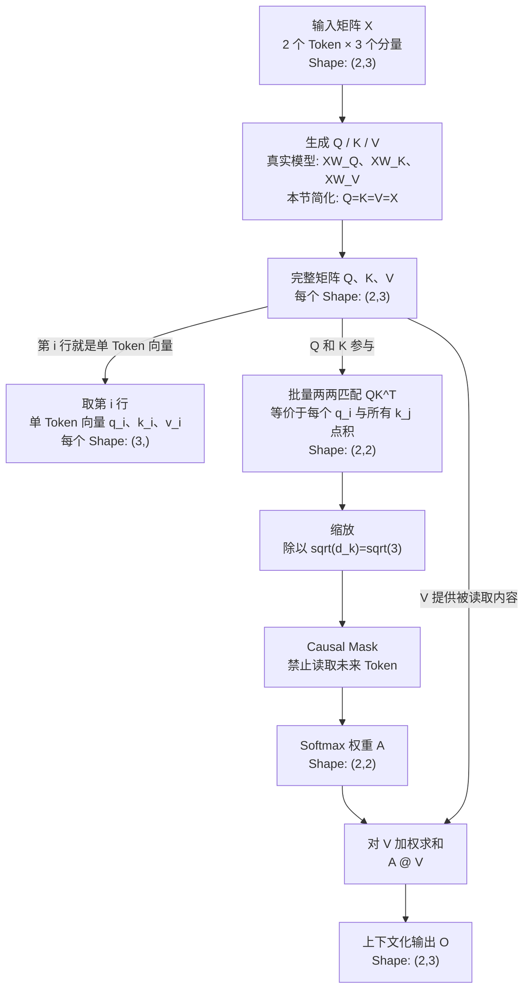

# Day 2：Self-Attention 如何读取上下文

## 本页知识流程图



读图时先抓住两条关系：

1. 小写 `q_i/k_i/v_i` 是大写 `Q/K/V` 的一行；
2. 逐 Token 计算与矩阵并行计算等价，后者一次完成全部 Token。

## 当前位于哪里

Day 1 已经让每个 Token 拥有自己的输入向量。本节只研究这些向量如何互相读取：

```text
输入向量 X
-> Q、K、V
-> Token 两两匹配分数
-> Causal Mask
-> Softmax 权重
-> 对 V 加权求和
-> 上下文化向量
```

## 本节使用最小示例

只使用 2 个 Token，每个向量只有 3 个分量：

| 行 | Token | 三维向量 |
| ---: | --- | --- |
| 1 | `Agent` | `[1, 2, 3]` |
| 2 | `tools` | `[3, 2, 1]` |

数字 `1、2、3` 只是方便手算的占位值，不代表预先定义好的语义。

Shape 的严格数学含义始终是 `(行数, 列数)`：

```text
X.shape = (行数, 列数) = (2, 3)
```

结合本例的数据布局，才可以进一步解释为：

```text
(Token 数量, 每个 Token 的向量维度) = (2, 3)
```

## 单个 Token 的小写向量与完整大写矩阵

为了先隔离矩阵乘法，本节暂时令 `Q = K = V = X`：

| Token | 自己的 Query 向量 | 自己的 Key 向量 | 自己的 Value 向量 |
| --- | --- | --- | --- |
| `Agent` | `q_Agent=[1,2,3]` | `k_Agent=[1,2,3]` | `v_Agent=[1,2,3]` |
| `tools` | `q_tools=[3,2,1]` | `k_tools=[3,2,1]` | `v_tools=[3,2,1]` |

因此：

- 单个 Token 的 Query 使用小写 `q` 表示，是长度为 3 的向量；
- `q_Agent` 和 `q_tools` 上下叠放，组成大写 Q，形状是 `(2,3)`；
- 完整 K、V 同理，形状也都是 `(2,3)`；
- 真实模型通过不同的可训练矩阵生成 Q、K、V，三者数值通常不同。

```text
单 Token：q_Agent 或 q_tools -> (3,)
整条序列：Q = stack(q_Agent, q_tools) -> (2,3)
两两分数：Q @ K.T -> (2,2)
```

> 不要说“每个 Token 的 Q 都是 `(2,3)`”。`(2,3)` 的第一维已经同时包含两个
> Token，因此它属于完整 Q。每个 Token 自己只有其中一个 3 维 q 向量。

在本教程限定的“一条序列、一个 layer、一个 head”里，只有一个大写 Q。真实模型
有多个 layer 和 head，每个 head 都有自己的 Q；工程实现通常把它们收进带有
batch/head 维度的张量。

### 大写 Q 是如何产生的

“Q 由小写 q 按行排列”描述的是数学关系，不代表真实代码一定先逐个创建 q 再调用
`stack`。真实模型通常直接计算：

```text
逐 Token 写法：q_Agent = x_Agent @ W_Q
               q_tools = x_tools @ W_Q

矩阵写法：     Q = X @ W_Q
```

矩阵乘法逐行处理 X，所以 Q 的第 1 行就是 `q_Agent`，第 2 行就是 `q_tools`。
两种写法数学上完全相同，矩阵写法更适合硬件并行。

### Attention 到底使用 q 还是 Q

两者都可以描述同一个计算：

```text
逐 Token：q_Agent @ K.T = [14,10]
           q_tools @ K.T = [10,14]

矩阵并行：Q @ K.T = [[14,10],
                      [10,14]]
```

概念上，每个 Token 的 `q_i` 分别参与计算；实现上，通常使用大写 Q 一次并行计算
所有 Token。并且每个 `q_i` 不是只与自己的 `k_i` 计算，而是与所有允许读取的
`k_j` 匹配，再根据权重对对应的 `v_j` 加权求和。

> Q 不是额外产生的新信息；它是所有 q 的矩阵表示，也是实际并行计算使用的张量。

## 步骤 3：完整计算匹配分数

### 3.0 先算一个匹配分数

从完整 Q 中抽出 `q_tools`，也就是第 2 行 `[3,2,1]`；从完整 K 中抽出
`k_Agent`，也就是第 1 行 `[1,2,3]`：

| 分量位置 | 1 | 2 | 3 |
| --- | ---: | ---: | ---: |
| `q_tools` | 3 | 2 | 1 |
| `k_Agent` | 1 | 2 | 3 |
| 对应位置相乘 | 3×1=3 | 2×2=4 | 1×3=3 |

```text
3 + 4 + 3 = 10
```

所以 `tools` 对 `Agent` 的原始匹配分数是 `10`。

### 3.1 为什么是 `(2,3) @ (3,2) -> (2,2)`

标准二维记号：

```text
Q:       (n_q, d_k)
K:       (n_k, d_k)
K.T:     (d_k, n_k)
Q @ K.T: (n_q, n_k)
```

本例 `n_q = n_k = 2`、`d_k = 3`：

```text
Q (2,3) @ K.T (3,2) -> 原始分数 (2,2)
```

- 中间的 `3`：一次比较使用两个长度为 3 的向量；
- 左侧的 `2`：有 2 个读取者；
- 右侧的 `2`：有 2 个信息来源；
- 输出 `2×2`：一共得到 4 个匹配分数。

### 3.2 四个格子全部手算

```text
① q_Agent · k_Agent
   [1,2,3] · [1,2,3] = 1×1 + 2×2 + 3×3 = 14

② q_Agent · k_tools
   [1,2,3] · [3,2,1] = 1×3 + 2×2 + 3×1 = 10

③ q_tools · k_Agent
   [3,2,1] · [1,2,3] = 3×1 + 2×2 + 1×3 = 10

④ q_tools · k_tools
   [3,2,1] · [3,2,1] = 3×3 + 2×2 + 1×1 = 14
```

所以：

```text
Q = [[1,2,3],
     [3,2,1]]

K.T = [[1,3],
       [2,2],
       [3,1]]

Q @ K.T = [[14,10],
           [10,14]]
```

### 3.3 缩放

缩放使用 Query/Key 的向量维度 `d_k=3`，不是 Token 数量 `2`：

```text
sqrt(d_k) = sqrt(3) ≈ 1.732

[[14, 10],      [[8.083, 5.774],
 [10, 14]]  ->   [5.774, 8.083]]
```

真实多头 Attention 通常还会加入 batch 和 head 维度。不同框架可能调整维度顺序，
但二维核心关系仍是 `softmax(QK^T / sqrt(d_k))V`。

参考：[Attention Is All You Need](https://arxiv.org/abs/1706.03762)、
[PyTorch MultiheadAttention](https://docs.pytorch.org/docs/stable/generated/torch.nn.MultiheadAttention.html)。

## 阅读教材

直接阅读脚本实际运行后生成的完整教材：

[Day 2 教材输出](OUTPUT.md)

学习者不需要亲自执行脚本。
